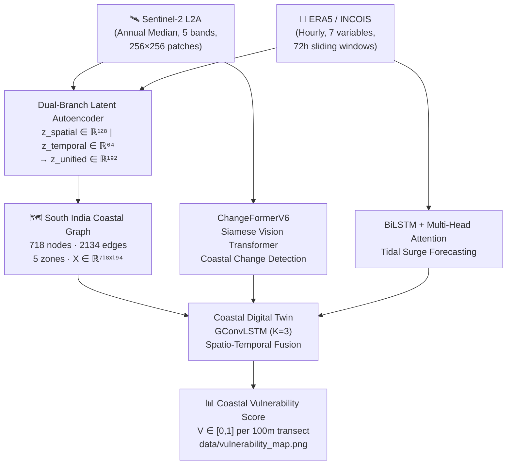

# samudrataṭa 🛰️🌊

> **Samudra** (समुद्र) = ocean · **Taṭa** (तट) = coast

[](https://www.python.org/downloads/)
[](https://pytorch.org/)
[](https://pyg.org/)
[](https://github.com/flykrth/samudratata/releases/tag/v1.0.0-Digital-Twin)
[](LICENSE)

A multimodal deep-learning pipeline for coastal vulnerability assessment along the South Indian
coastline. Fuses **Sentinel-2 multispectral imagery** and **ERA5 oceanographic time-series**
(2019–2024) through a cascade of four models to produce per-transect Coastal Vulnerability
Scores at 100 m resolution across 5 study zones.

---

## ⚡ Instant Asset Download (For Evaluators & TAs)

Download the finalized graph dataset, oceanographic time-series, and pre-trained model weights directly into your local repository clone using **`wget`** or **`curl`** from the [v1.0.0-Digital-Twin Release](https://github.com/flykrth/samudratata/releases/tag/v1.0.0-Digital-Twin):

### 📥 Option A: Download via `wget`
```bash
# 1. Ensure target directories exist
mkdir -p data/ocean weights

# 2. Download South India Coastal Graph Dataset (PyTorch Geometric, 718 nodes, 2134 edges)
wget -O data/south_india_coastal_graph.pt \
  https://github.com/flykrth/samudratata/releases/download/v1.0.0-Digital-Twin/south_india_coastal_graph.pt

# 3. Download Ocean Reanalysis Time-Series Dataset (72h sliding window, ERA5/INCOIS)
wget -O data/ocean/ocean_timeseries_72h.h5 \
  https://github.com/flykrth/samudratata/releases/download/v1.0.0-Digital-Twin/ocean_timeseries_72h.h5

# 4. Download Best-Trained GConvLSTM Digital Twin Weights
wget -O weights/gconvlstm_best.pt \
  https://github.com/flykrth/samudratata/releases/download/v1.0.0-Digital-Twin/gconvlstm_best.pt
cp weights/gconvlstm_best.pt weights/digital_twin_gnn_best.pt

# 5. (Optional) Download Tidal Surge BiLSTM Model Weights
wget -O weights/surge_lstm_best.pt \
  https://github.com/flykrth/samudratata/releases/download/v1.0.0-Digital-Twin/surge_lstm_best.pt
```

### 📥 Option B: Download via `curl`
```bash
# 1. Ensure target directories exist
mkdir -p data/ocean weights

# 2. Download South India Coastal Graph Dataset (PyTorch Geometric, 718 nodes, 2134 edges)
curl -L -o data/south_india_coastal_graph.pt \
  https://github.com/flykrth/samudratata/releases/download/v1.0.0-Digital-Twin/south_india_coastal_graph.pt

# 3. Download Ocean Reanalysis Time-Series Dataset (72h sliding window, ERA5/INCOIS)
curl -L -o data/ocean/ocean_timeseries_72h.h5 \
  https://github.com/flykrth/samudratata/releases/download/v1.0.0-Digital-Twin/ocean_timeseries_72h.h5

# 4. Download Best-Trained GConvLSTM Digital Twin Model Weights
curl -L -o weights/gconvlstm_best.pt \
  https://github.com/flykrth/samudratata/releases/download/v1.0.0-Digital-Twin/gconvlstm_best.pt
cp weights/gconvlstm_best.pt weights/digital_twin_gnn_best.pt

# 5. (Optional) Download Tidal Surge BiLSTM Model Weights
curl -L -o weights/surge_lstm_best.pt \
  https://github.com/flykrth/samudratata/releases/download/v1.0.0-Digital-Twin/surge_lstm_best.pt
```

---

## Architecture Overview



---

## Study Zones

| Zone | Coast | Sea | State | Transects |
|---|---|---|---|---|
| Chellanam | SW | Arabian Sea | Kerala | 115 |
| Alappuzha | SW | Arabian Sea | Kerala | 113 |
| Nagapattinam | SE | Bay of Bengal | Tamil Nadu | 111 |
| Cuddalore | SE | Bay of Bengal | Tamil Nadu | 96 |
| Visakhapatnam | SE | Bay of Bengal | Andhra Pradesh | 283 |

---

## Repository Structure

```
samudratata/
├── src/
│   ├── models/
│   │   ├── model_mismatch_autoencoder.py   # Dual-Branch Latent Autoencoder (SSIM + Huber)
│   │   ├── train_mismatch_autoencoder.py   # Autoencoder training loop
│   │   ├── train_changeformer_coastal.py   # ChangeFormerV6 fine-tuning (coastal CD)
│   │   ├── train_surge_lstm.py             # BiLSTM + Multi-Head Attention surge model
│   │   ├── train_digital_twin_gnn.py       # GConvLSTM Coastal Digital Twin
│   │   └── evaluate_digital_twin.py        # MC Dropout UQ + Ablation Study evaluation
│   ├── preprocessing/
│   │   ├── fetch_sentinel2_data.py         # CDSE / GEE Sentinel-2 downloader
│   │   ├── fetch_ocean_timeseries.py       # ERA5 oceanographic time-series extractor
│   │   ├── preprocess_changeformer.py      # Patch builder + NDWI dataset assembler
│   │   ├── preprocess_ocean_timeseries.py  # Cubic-spline interpolation + 72h windows
│   │   ├── build_coastal_graph.py          # PyG coastal graph constructor
│   │   └── extract_latent_features.py      # Unified z ∈ ℝ¹⁹² node embedding extractor
│   └── utils/
│       ├── config_setup.py                 # Authentication & credential verification
│       ├── verify_ocean_pipeline.py        # Ocean pipeline sanity checks
│       └── visualize_graph.py              # Coastal graph topology visualiser
├── data/
│   ├── coastline/
│   │   └── south_india_coastline.geojson   # Official coastline geometry (5 zones)
│   ├── south_india_coastal_graph.pt        # ⭐ Frozen PyG dataset (718 nodes, 2134 edges)
│   ├── graph_schema.json                   # Machine-readable graph metadata
│   ├── dataset_card.md                     # Full dataset documentation
│   ├── vulnerability_map.png               # Geographic vulnerability map (test set)
│   ├── coastal_graph_topology.png          # Graph topology visualisation
│   └── loss_curve.png                      # ChangeFormer training curves
├── weights/
│   ├── digital_twin_gnn_best.pt            # GConvLSTM checkpoint (~0.8 MB)
│   └── surge_lstm_best.pt                  # BiLSTM checkpoint (~3.8 MB)
├── notebooks/                              # Jupyter notebooks (EDA, ablations)
├── ChangeFormer/                           # ChangeFormerV6 submodule (Siamese ViT)
├── requirements.txt
├── .env.example
└── .gitignore
```

> **Note on large checkpoints:** `autoencoder_best.pt` (~211 MB) and
> `changeformer_coastal_best.pt` (~249 MB) exceed GitHub's 100 MB limit and are
> not tracked in git. Download them from the [Releases](https://github.com/flykrth/samudratata/releases)
> page and place them in `data/`.

---

## Installation

### Prerequisites

- Python 3.10+
- CUDA 11.8+ (recommended) or CPU-only
- Git with LFS (for the frozen graph dataset)

### Setup

```bash
# 1. Clone with submodules
git clone --recurse-submodules https://github.com/flykrth/samudratata.git
cd samudratata

# 2. Create virtual environment
python3 -m venv .venv
source .venv/bin/activate          # Windows: .venv\Scripts\activate

# 3. Install PyTorch (adjust CUDA version as needed)
pip install torch torchvision --index-url https://download.pytorch.org/whl/cu118

# 4. Install PyG + sparse dependencies (CUDA 11.8 example)
pip install torch_geometric
pip install torch-scatter torch-sparse \
    -f https://data.pyg.org/whl/torch-2.0.0+cu118.html

# 5. Install all remaining dependencies
pip install -r requirements.txt

# 6. Configure credentials
cp .env.example .env
# Edit .env — set AUTH_BACKEND=cdse or gee and fill in API keys

# 7. Verify authentication
python src/utils/config_setup.py
```

---

## Quick-Start: Run Inference

The primary inference entry-point is `evaluate_digital_twin.py`, which runs **Monte Carlo
Dropout Uncertainty Quantification** and an **Ablation Study** across three model variants
using the pre-trained GConvLSTM checkpoint.

```bash
# Evaluate the Coastal Digital Twin on the test split
# Requires: data/south_india_coastal_graph.pt, weights/digital_twin_gnn_best.pt
python src/models/evaluate_digital_twin.py

# Optional flags:
#   --graph-pt    PATH   Path to the PyG graph file (default: data/south_india_coastal_graph.pt)
#   --checkpoint  PATH   Path to GConvLSTM checkpoint (default: data/digital_twin_gnn_best.pt)
#   --mc-samples  N      MC Dropout forward passes for uncertainty (default: 50)
#   --smoke-test         Run on a tiny subset for quick sanity check
```

**Output artefacts generated:**

| File | Description |
|---|---|
| `data/performance_matrix.png` | Precision / Recall / F1 / AUROC / RMSE / MAE / R² comparison across 3 model variants |
| `data/uncertainty_plot.png` | 72-hour vulnerability forecast with 95% MC confidence intervals |
| `data/evaluation_summary.json` | Machine-readable metric table |

---

## Training Pipeline

Run each stage in sequence to reproduce the full pipeline from raw data.

### Stage 1 — Data Acquisition

```bash
# Sentinel-2 L2A coastal imagery (requires CDSE/GEE credentials)
python src/preprocessing/fetch_sentinel2_data.py --live

# ERA5 hourly oceanographic time-series (requires CDS API key)
python src/preprocessing/fetch_ocean_timeseries.py
```

### Stage 2 — Preprocessing

```bash
# Build ChangeFormer bitemporal patch dataset
python src/preprocessing/preprocess_changeformer.py

# Interpolate & window ocean time-series (72h)
python src/preprocessing/preprocess_ocean_timeseries.py
```

### Stage 3 — Dual-Branch Latent Autoencoder

Resolves the spatial-temporal mismatch between $H \times W$ imagery and 72h time-series,
producing unified node embeddings $z \in \mathbb{R}^{192}$.

```bash
# Train (smoke-test runs 2 epochs on a 5-sample subset)
python src/models/train_mismatch_autoencoder.py --epochs 5 --smoke-test

# Extract node embeddings
python src/preprocessing/extract_latent_features.py
```

### Stage 4 — Coastal Graph Construction

```bash
# Build PyG graph (outputs data/south_india_coastal_graph.pt)
python src/preprocessing/build_coastal_graph.py

# Visualise graph topology
python src/utils/visualize_graph.py
```

### Stage 5 — ChangeFormer Siamese-ViT (Coastal Change Detection)

Fine-tunes ChangeFormerV6 pre-trained on LEVIR-CD. Freezes the Siamese ViT encoder
(~28.9M params) and fine-tunes only the MLP decoder head (~12.1M params).

```bash
python src/models/train_changeformer_coastal.py --epochs 10 --smoke-test
```

### Stage 6 — BiLSTM + Multi-Head Attention (Tidal Surge Forecasting)

```bash
# Train surge model
python src/models/train_surge_lstm.py --epochs 20 --smoke-test

# Evaluate and generate attention heatmap artefact
python src/models/train_surge_lstm.py --eval-only --smoke-test
```

### Stage 7 — Coastal Digital Twin GConvLSTM

Fuses multimodal representations onto the coastal graph for end-to-end
vulnerability mapping across all 718 transects.

```bash
python src/models/train_digital_twin_gnn.py --epochs 35
# → saves weights/digital_twin_gnn_best.pt and data/vulnerability_map.png
```

---

## Models

### Dual-Branch Latent Autoencoder

Resolves the spatial-temporal dimensionality mismatch:

- **Spatial Branch:** 4-stage 2D-CNN encoder → $z_{\text{spatial}} \in \mathbb{R}^{128}$ (2,560× compression) · MSE + SSIM reconstruction loss
- **Temporal Branch:** 3-layer 1D-CNN ($k=[7,5,3]$) → $z_{\text{temporal}} \in \mathbb{R}^{64}$ (7.88× compression) · Huber Loss
- **Unified Embedding:** $z = [z_{\text{spatial}}; z_{\text{temporal}}] \in \mathbb{R}^{192}$ (1,709× overall compression)

### ChangeFormer Siamese-ViT

- **Backbone:** ChangeFormerV6 with Siamese ViT encoder + multi-scale MLP decoder
- **Transfer Learning:** LEVIR-CD building change detection pre-training
- **Coastal Adaptation:** Binary land/water boundary change masks from NDWI transitions
- **Metrics tracked:** F1, IoU, Precision, Recall, Accuracy (WandB)

### BiLSTM + Multi-Head Attention

- **Backbone:** 2-layer Bidirectional LSTM ($h=64$, 128-dim temporal representation)
- **Attention:** 4-head MHA isolating critical storm-buildup hours within the 72h window
- **Loss:** Huber Loss ($\delta=1.0$) robust to cyclonic surge outliers ($H_s > 4.5$ m)
- **Artefact:** `data/attention_heatmap.png` — per-head attention, cross-temporal self-attention, physical driver dynamics

### Coastal Digital Twin GConvLSTM

- **Core:** Chebyshev Graph Convolutional LSTM ($K=3$) with spatial message passing
- **Input graph:** South India Coastal Graph (718 nodes, 2134 edges, $X \in \mathbb{R}^{718 \times 194}$)
- **Temporal depth:** $T=6$ years (2019–2024) of multi-year latent sequences
- **Output:** Per-transect Coastal Vulnerability Score $V \in [0, 1]$
- **Artefact:** `data/vulnerability_map.png` — multi-panel geographic projection

### Evaluation Framework (`evaluate_digital_twin.py`)

Three experimental components:
1. **Monte Carlo Dropout UQ** — $N=50$ stochastic forward passes → 95% confidence bounds
2. **Ablation Study** — Baseline A (BiLSTM only), Baseline B (ChangeFormer + GCN), Full GConvLSTM
3. **Metrics** — Classification: Precision / Recall / F1 / AUROC · Regression: RMSE / MAE / R² / Pearson r

---

## Dataset

See [`data/dataset_card.md`](data/dataset_card.md) for full documentation of the South India
Coastal Graph Dataset including node feature schema, edge connectivity semantics, zone
statistics, and data lineage.

---

## Authentication

| Backend | Registration | Notes |
|---|---|---|
| **CDSE** | [dataspace.copernicus.eu](https://dataspace.copernicus.eu) | Free · OAuth2 token flow |
| **GEE** | [earthengine.google.com](https://earthengine.google.com) | GCP project required · ADC or service account |
| **CDS** | [cds.climate.copernicus.eu](https://cds.climate.copernicus.eu) | Free · API key in `~/.cdsapirc` |

See `.env.example` for the full list of required environment variables.

---

## Roadmap

- [x] Credential management & authentication smoke-tests
- [x] Sentinel-2 data acquisition & preprocessing
- [x] ERA5 oceanographic time-series preprocessing
- [x] Dual-Branch Latent Autoencoder + SSIM loss
- [x] Unified node latent extraction ($z \in \mathbb{R}^{192}$)
- [x] PyG Coastal Graph with longshore drift topology
- [x] Geographic graph topology visualisation
- [x] ChangeFormer Siamese-ViT coastal fine-tuning + WandB
- [x] BiLSTM + Multi-Head Attention tidal surge modelling
- [x] GConvLSTM Coastal Digital Twin + vulnerability mapping
- [x] MC Dropout UQ + Ablation Study evaluation framework
- [x] Open-source release (standard ML repo structure)
- [ ] Hugging Face Hub model cards for large checkpoints
- [ ] Jupyter notebook walkthroughs (EDA, ablation visualisations)
- [ ] Docker image for reproducible inference

---

## License

MIT — see [LICENSE](ChangeFormer/LICENSE) for full terms.

---

## Acknowledgements

- [ChangeFormer](https://github.com/wgcban/ChangeFormer) — Siamese Vision Transformer for change detection
- [PyTorch Geometric Temporal](https://pytorch-geometric-temporal.readthedocs.io) — GConvLSTM implementation
- [Copernicus Data Space Ecosystem](https://dataspace.copernicus.eu) — Sentinel-2 imagery
- [ECMWF ERA5](https://www.ecmwf.int/en/forecasts/datasets/reanalysis-datasets/era5) — Oceanographic reanalysis
- CESS & ICMAM — Coastal geomorphology calibration profiles for peninsular India
